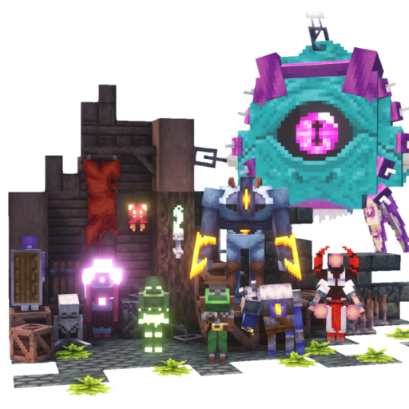
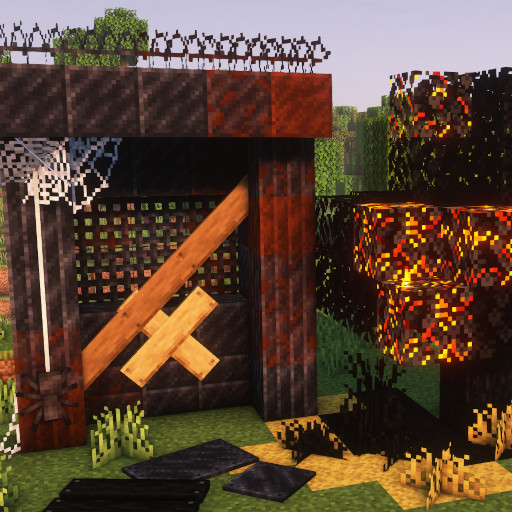

## Hi, my name is Dominik :wave::smiley_cat:

But online, you can call me Mim1q! :grin:

I'm a Minecraft Fabric mod developer, pixel artist, and a member of [Luna Pixel Studios](https://www.bisecthosting.com/p/lunapixel).   
Currently, I'm also an Information Technology student and a kids' programming tutor :computer::notebook:

  
  

## Notable projects

Most of my projects' source code is available on GitHub! I encourage everyone who wants to start modding Minecraft to check them out, learn from them, and contribute if they want to!

However, please keep in mind that the artistic assets (textures, models, sounds, etc.) are explicitly not licensed for redistribution. Please respect this and do not use them in your own projects.

### Mine Cells

Mine Cells is a Minecraft mod bringing the world of Dead Cells into Minecraft. It features multiple dimensions, new mobs, weapons, game mechanics and more!  
It is my first, most ambitious, and most successful project to date. It has been featured in multiple fantastic modpacks, such as [Prominence II RPG](https://www.curseforge.com/minecraft/modpacks/prominence-2-rpg), [Fantasy MC](https://www.curseforge.com/minecraft/modpacks/fantasy-minecraft-fabric) and many more!

A custom [3D Weapon Resource Pack](https://legacy.curseforge.com/minecraft/texture-packs/mine-cells-3d-weapons-pack) is also available for Mine Cells.

  

### Derelict

Derelict introduces a bunch of new run-down decorative content to Minecraft and utilities that make building abandoned structures a breeze. More exciting gameplay features are planned for the future!

   

### Gimm1q 

Gimm1q is a small library I use in my mods to simplify some common tasks and provide utilities that are not present in the Fabric API. It's fully documented and open-source, so feel free to include it in your projects! The full feature list is available in the [repository's README](https://github.com/mim1q/gimm1q).
